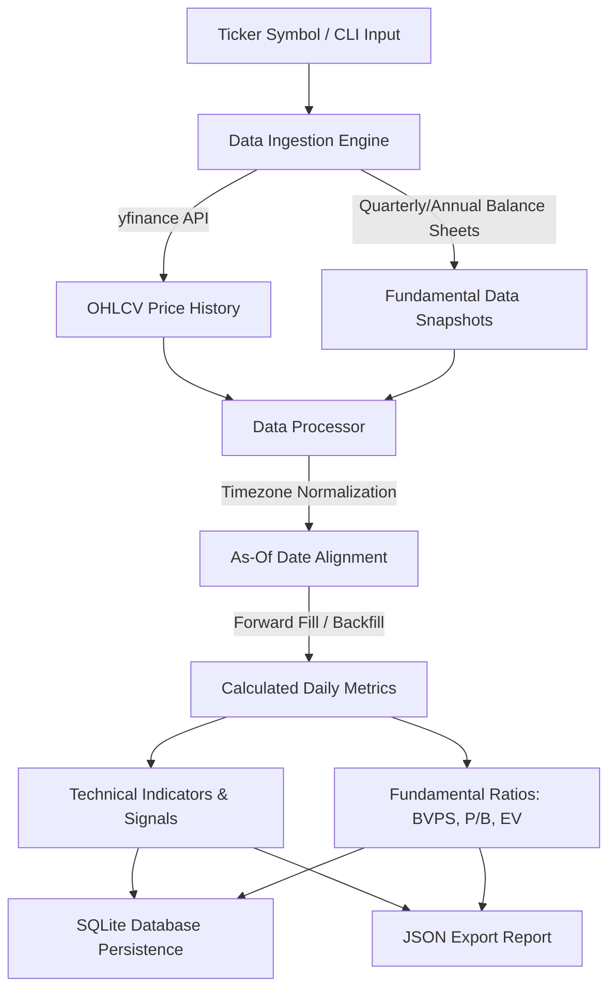

# 📈 Financial Analyzer

<p align="center">
  
  
  
  
  
</p>

An end-to-end stock analysis framework for **US** and **Indian equities**. Merges historical OHLCV price action with fundamental financial statements to compute technical indicators, detect **Golden Crossovers** & **Death Crossovers**, and evaluate fundamental ratios like **Price-to-Book (P/B)**, **Book Value Per Share (BVPS)**, and **Enterprise Value (EV)**.

---

## 🌟 Key Features

- **🌐 Cross-Market Equity Support**: Handles US stocks (e.g. `NVDA`, `AAPL`) and Indian NSE stocks (e.g. `RELIANCE.NS`, `SWIGGY.NS`).
- **🛡️ Robust Multi-Tier Data Fallback**: Extracts financial statements from quarterly balance sheets, annual balance sheets, or real-time ticker snapshots.
- **📊 Technical Analysis Engine**:
  - 50-day & 200-day Simple Moving Averages (SMA)
  - 52-week High/Low detection and percentage drawdown calculation
  - Vectorized **Golden Cross** ($SMA_{50} \text{ crosses above } SMA_{200}$) & **Death Cross** ($SMA_{50} \text{ drops below } SMA_{200}$) signal detection
- **💼 Fundamental Valuation Ratios**:
  - Book Value Per Share ($\text{BVPS} = \frac{\text{Stockholder Equity}}{\text{Shares Outstanding}}$)
  - Price-to-Book ($\text{P/B} = \frac{\text{Close Price}}{\text{BVPS}}$)
  - Enterprise Value ($\text{EV} = \text{Market Cap} + \text{Total Debt} - \text{Cash}$)
- **🗄️ Idempotent SQLite Persistence**: Uses `INSERT OR REPLACE` transactions to allow safe, duplicate-free execution reruns.

---

## 🏗️ System Architecture



---

## 📂 Project Structure

```text
Financial_analyzer-main/
└── financial_analyzer/
    ├── src/
    │   ├── __init__.py
    │   ├── config.py           # Configuration loader (YAML & Defaults)
    │   ├── data_fetcher.py     # yfinance API wrapper & fallback strategy
    │   ├── database.py         # SQLAlchemy models & SQLite idempotent storage
    │   ├── main.py             # Typer CLI application entry point
    │   ├── models.py           # Pydantic v2 validation schemas
    │   ├── processor.py        # Pandas metric calculations & datetime merging
    │   └── signals.py          # Crossover signal detection algorithms
    ├── tests/
    │   ├── conftest.py         # Pytest fixtures
    │   ├── test_data_fetcher.py # Ingestion & series extraction tests
    │   ├── test_database.py    # SQLite persistence & serialization tests
    │   ├── test_processor.py   # Technical indicator & fundamental ratio tests
    │   └── test_signals.py     # Crossover detection tests
    ├── config.yaml.example     # Configuration template
    ├── pyproject.toml          # Dependencies & pytest configuration
    └── uv.lock                 # Lockfile
```

---

## 🚀 Quick Start

### 🔧 Prerequisites

- **Python 3.12+**
- **[uv](https://docs.astral.sh/uv/)** or **pip**

### 📦 Installation

```bash
# Navigate into working directory
cd financial_analyzer
```

Option 1: Using `uv` (Recommended)
```bash
uv sync
```

Option 2: Using standard `pip` / `venv`
```bash
python3 -m venv .venv
source .venv/bin/activate
pip install -e . pytest ruff
```

### ⚙️ Configuration Setup

Copy the example configuration file:

```bash
cp config.yaml.example config.yaml
```

Example `config.yaml`:

```yaml
database:
  path: "financial_data.db"

logging:
  level: "INFO"

data_settings:
  historical_period: "5y"
  min_trading_days_for_sma: 200
```

---

## 💻 Usage

Run the analysis pipeline using the CLI for any supported ticker:

```bash
# Analyze a US Technology Stock (NVIDIA)
python -m src.main run --ticker NVDA --output nvda_analysis.json

# Analyze an Indian Equities Stock (Reliance Industries)
python -m src.main run --ticker RELIANCE.NS --output reliance_analysis.json

# Analyze a Recent IPO Stock (Swiggy)
python -m src.main run --ticker SWIGGY.NS --output swiggy_analysis.json
```

### 📋 CLI Command Options

| Option | Type | Default | Description |
| :--- | :--- | :--- | :--- |
| `--ticker` | `TEXT` | *(Required)* | Stock ticker symbol (e.g., `NVDA`, `AAPL`, `RELIANCE.NS`) |
| `--output` | `TEXT` | `analysis.json` | Output path for exported JSON summary report |
| `--initdb` / `--no-initdb` | `BOOL` | `True` | Automatically initialize SQLite database tables before execution |

### 🧩 Core Modules Overview

- **`src.config`**: Loads settings from `config.yaml` with built-in default fallbacks.
- **`src.data_fetcher`**: Wraps `yfinance` to fetch OHLCV history and execute multi-tier balance sheet fallback strategies.
- **`src.processor`**: Aligns prices with fundamentals via `merge_asof`, computes 50/200-day SMAs, 52-week drawdowns, BVPS, P/B, and EV.
- **`src.signals`**: Detects vectorized **Golden Cross** and **Death Cross** signals.
- **`src.database`**: Manages SQLAlchemy schema and idempotent SQLite storage using `INSERT OR REPLACE`.
- **`src.models`**: Pydantic v2 schemas for data validation and export payloads.

---

## 🗄️ Database Schema

The SQLite database (`financial_data.db`) consists of three relational tables:

### 1. `tickers`
Stores metadata for analyzed stock tickers.

| Column | Type | Description |
| :--- | :--- | :--- |
| `id` | `INTEGER` | Primary Key |
| `ticker` | `TEXT` | Stock Ticker Symbol (Unique) |
| `added_at` | `DATETIME` | Timestamp added |
| `info` | `TEXT` | JSON raw info string |

### 2. `daily_metrics`
Stores complete daily technical indicators and fundamental valuation ratios.

| Column | Type | Description |
| :--- | :--- | :--- |
| `id` | `INTEGER` | Primary Key |
| `ticker` | `TEXT` | Ticker Symbol (Index) |
| `date` | `DATE` | Trading Date (Index) |
| `open` / `high` / `low` / `close` | `FLOAT` | OHLC Prices |
| `volume` | `INTEGER` | Trading Volume |
| `sma50` | `FLOAT` | 50-day Simple Moving Average |
| `sma200` | `FLOAT` | 200-day Simple Moving Average |
| `bvps` | `FLOAT` | Book Value Per Share |
| `price_to_book` | `FLOAT` | Price-to-Book Ratio (P/B) |
| `enterprise_value` | `FLOAT` | Enterprise Value (EV) |

*Unique Constraint*: `(ticker, date)`

### 3. `signal_events`
Stores detected trading crossover events.

| Column | Type | Description |
| :--- | :--- | :--- |
| `id` | `INTEGER` | Primary Key |
| `ticker` | `TEXT` | Stock Ticker Symbol |
| `date` | `DATE` | Signal Trigger Date |
| `signal_type` | `TEXT` | `golden_cross` or `death_cross` |
| `meta` | `TEXT` | Event metadata |

*Unique Constraint*: `(ticker, date, signal_type)`

---

## 🧪 Testing & Code Quality

Run automated unit test suite (8 tests covering data fetcher, processor, signals, and SQLite database):

```bash
pytest
```

Check code style and linting with Ruff:

```bash
uv run ruff check .
```

---

## 📊 Sample Output Format

Generated JSON summary report (`nvda_analysis.json`):

```json
{
  "ticker": "NVDA",
  "generated_at": "2026-08-08T05:08:01.540596+00:00",
  "price_rows_count": 1255,
  "fundamentals_used": "quarterly_balance_sheet",
  "signals": [
    {
      "date": "2021-10-19T00:00:00",
      "signal_type": "golden_cross",
      "meta": {}
    },
    {
      "date": "2022-03-10T00:00:00",
      "signal_type": "death_cross",
      "meta": {}
    }
  ]
}
```

